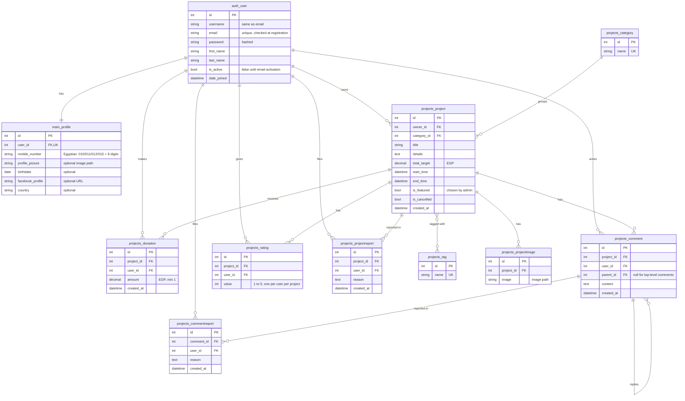

# Database ERD

GitHub renders the diagram below automatically. Table names are the ones Django creates (`<app>_<model>`); `auth_user` is Django's built-in user table.

`projects_project` and `projects_tag` are linked through Django's join table `projects_project_tags` (`project_id`, `tag_id`).

## Rules enforced by the code

| Rule | Where |
|---|---|
| A user can't log in until they click the activation link (valid 24 hours) | `main/views.py`, `main/tokens.py` |
| Mobile number must be Egyptian | `main/forms.py` |
| One rating per user per project (rating again updates it) | `Rating` unique constraint, `projects/views.py` |
| Owner can cancel only while donations are under 25% of the target | `Project.can_be_cancelled` |
| Donations only while the campaign is running and not cancelled | `Project.is_running`, `projects/views.py` |
| End time must be after start time | `projects/forms.py` |
| Deleting a user deletes their profile, projects, donations, comments, ratings and reports | `on_delete=CASCADE` |
| A category that still has projects can't be deleted | `on_delete=PROTECT` |

The chatbot stores nothing in the database; its per-visitor rate limit lives in the session.
